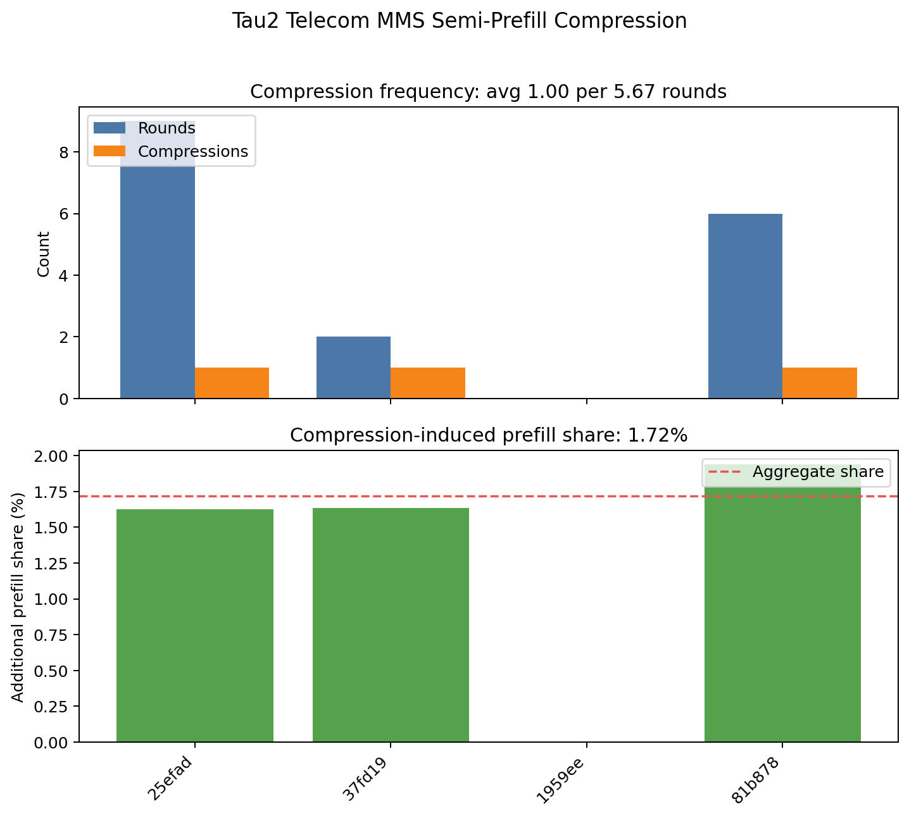
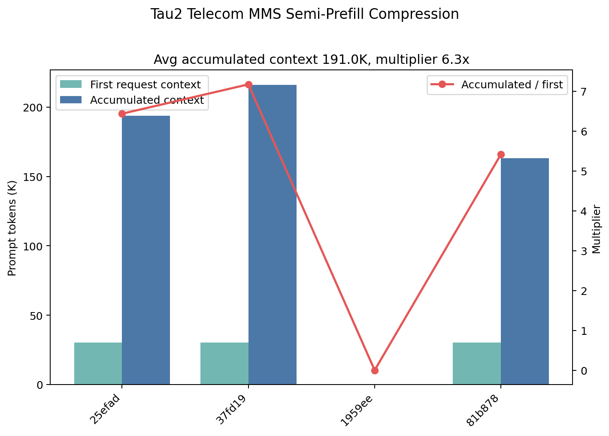
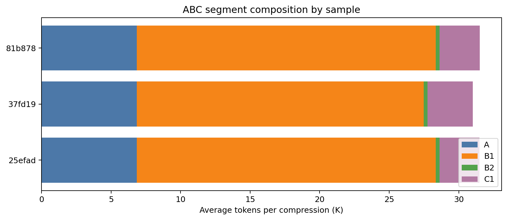
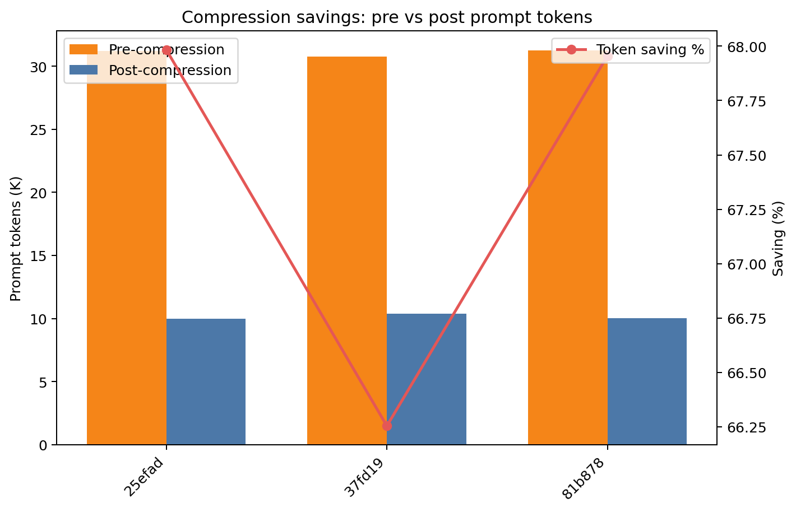
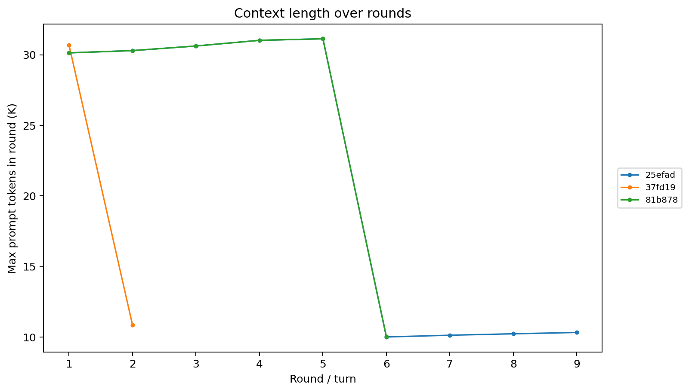
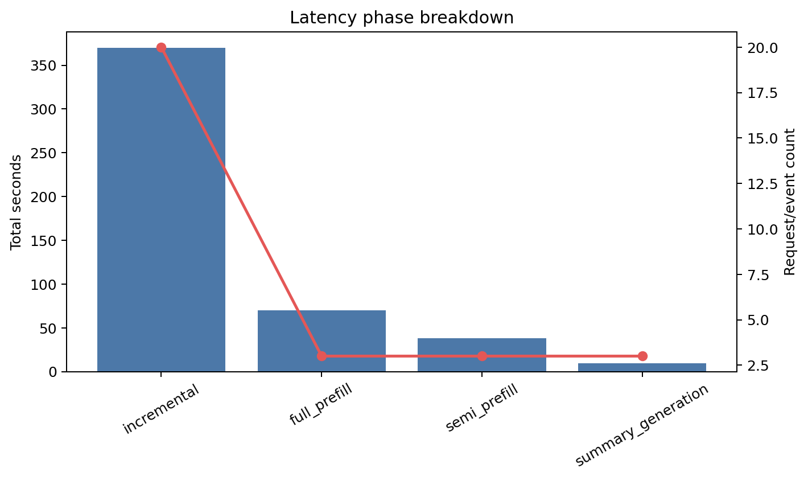

# Tau2 Telecom MMS Semi-Prefill Compression 分析报告

生成时间：20260507

## 结论摘要

- 可读样本数：4；有效 timing 样本数：3；压缩事件数：3；总 rounds：17；总 LLM calls：26。
- 平均每个 agentic request 运行 5.67 rounds / 8.67 LLM calls，并触发 1.00 次压缩。
- 压缩引入的额外 prefill tokens 为 9,840，占累计 prompt/context tokens 的 1.72%。
- 单请求平均累计上下文为 190,983 tokens；相比首轮单次请求，平均为 6.34x，样本范围为 5.4x-7.2x。

目录名包含 n20，但当前结果目录中实际可读 timing/ABC 样本数以文件系统为准。

## 数据口径

- `rounds` 优先采用 run summary 中的 turns/decoded_turns；没有 summary 时使用 timing 日志中的唯一 turn 数。
- `LLM calls` 来自 `timing/*.json` 记录条数。
- 每请求均值只使用 `steps>0` 且首轮 `prompt_tokens>0` 的有效 timing 样本；空样本仍保留在完整性统计和样本表中。
- `accumulated context` 定义为单个样本所有 LLM request 的 `prompt_tokens` 之和。
- `single-round inference` 对照定义为该样本第一条 timing 记录的 `prompt_tokens`。
- `additional prefill tokens due to compression` 优先采用 timing 的 `semi_prefill_tokens`；若没有该字段，则采用 ABC 压缩事件中的 `B2+C1`。
- 本报告不读取或输出长 prompt 原文，只保留 timing/ABC 的标量统计字段。

## 数据完整性

| 项目 | 数量 |
| --- | ---: |
| timing files | 4 |
| ABC files | 4 |
| trace files | 4 |
| prompt log files | 4 |
| checkpoint files | 4 |
| declared sample ids | 20 |

## Figure 1：压缩频率与额外 Prefill 占比

As shown in Figure 1, a single agentic request invokes 1.00 compressions per 5.67 rounds on average, while the additional prefill tokens due to compression account for 1.72% of accumulated prompt tokens.

中文解读：图 1 同时展示每个样本的 rounds、压缩次数和压缩导致的额外 prefill 占比。整体压缩频率为 0.18 次/round，这对应压缩触发概率 P 的经验估计。

## Figure 2：多轮累计上下文与单轮对照

As shown in Figure 2, a single agentic request often spans 5.67 rounds and accumulates a total of 191.0K context tokens, which is 5.4x-7.2x longer than single-round inference.

中文解读：图 2 展示首轮上下文、累计上下文以及累计/首轮倍数。该图说明 agentic request 的成本不能只按单轮推理估计；多轮调用会重复携带或重建大量上下文。

## 样本工作负载表

| 样本 | run | rounds | LLM calls | compressions | P | first ctx | max ctx | acc ctx | acc/first | extra prefill |
| --- | --- | --- | --- | --- | --- | --- | --- | --- | --- | --- |
| 25efad | real_mms_easy_user3_agent1_n20_compressed_only_cw32000_thr30000_c12800_20260507_001 | 9 | 9 | 1 | 0.11 | 30,135 | 31,132 | 193,859 | 6.43 | 1.62% |
| 37fd19 | real_mms_easy_user3_agent1_n20_compressed_only_cw32000_thr30000_c12800_20260507_001 | 2 | 11 | 1 | 0.50 | 30,112 | 30,685 | 215,874 | 7.17 | 1.63% |
| 1959ee | real_mms_easy_user3_agent1_n20_compressed_only_cw32000_thr30000_c12800_20260507_001 | 0 | 0 | 0 | - | 0 | 0 | 0 | - | - |
| 81b878 | real_mms_easy_user3_agent1_n20_compressed_only_cw32000_thr30000_c12800_20260507_001 | 6 | 6 | 1 | 0.17 | 30,135 | 31,132 | 163,215 | 5.42 | 1.94% |

## 压缩事件表

| 样本 | idx | turn | step | pre | post | B1 | B2 | C1 | B2+C1 | saving | summary s |
| --- | --- | --- | --- | --- | --- | --- | --- | --- | --- | --- | --- |
| 25efad | 1 | 6 | 5 | 31,225 | 9,997 | 21,498 | 270 | 2,879 | 3,149 | 67.98% | 2.9 |
| 37fd19 | 1 | 1 | 5 | 30,741 | 10,374 | 20,637 | 270 | 3,259 | 3,529 | 66.25% | 3.2 |
| 81b878 | 1 | 6 | 5 | 31,238 | 10,010 | 21,498 | 270 | 2,892 | 3,162 | 67.96% | 3.2 |

ABC 分段图如下：

压缩前后 prompt token 对比如下：

## Context 长度随轮次变化

这张图采用每个 round 内最大的 `prompt_tokens` 作为该 round 的上下文长度。如果 run_config 中存在 threshold，图中会画出阈值线。

## Timing / Phase Breakdown

| phase | count | prompt tokens | output tokens | total s |
| --- | --- | --- | --- | --- |
| full_prefill | 3 | 90,382 | 238 | 70.0 |
| incremental | 20 | 452,182 | 1,318 | 369.9 |
| semi_prefill | 3 | 30,384 | 113 | 38.0 |
| summary_generation | 3 | 0 | 0 | 9.2 |

## 配置摘要

| run | key | value |
| --- | --- | --- |
| real_mms_easy_user3_agent1_n20_compressed_only_cw32000_thr30000_c12800_20260507_001 | run_name | real_mms_easy_user3_agent1_n20_compressed_only_cw32000_thr30000_c12800_20260507_001 |
| real_mms_easy_user3_agent1_n20_compressed_only_cw32000_thr30000_c12800_20260507_001 | created_at | 2026-05-07T03:22:50.681328 |
| real_mms_easy_user3_agent1_n20_compressed_only_cw32000_thr30000_c12800_20260507_001 | domain | telecom |
| real_mms_easy_user3_agent1_n20_compressed_only_cw32000_thr30000_c12800_20260507_001 | mode | compressed |
| real_mms_easy_user3_agent1_n20_compressed_only_cw32000_thr30000_c12800_20260507_001 | model | Llama-3.3-70B-Instruct |
| real_mms_easy_user3_agent1_n20_compressed_only_cw32000_thr30000_c12800_20260507_001 | model_path | /root/share/models/Llama-3.3-70B-Instruct |
| real_mms_easy_user3_agent1_n20_compressed_only_cw32000_thr30000_c12800_20260507_001 | proxy_url | http://localhost:6003/v1 |
| real_mms_easy_user3_agent1_n20_compressed_only_cw32000_thr30000_c12800_20260507_001 | vllm_backend_url | http://10.10.111.43:8005 |
| real_mms_easy_user3_agent1_n20_compressed_only_cw32000_thr30000_c12800_20260507_001 | sample_ids_file | data/telecom_mms_easy_none_user3_agent1_actions_4_6_ids.json |
| real_mms_easy_user3_agent1_n20_compressed_only_cw32000_thr30000_c12800_20260507_001 | num_sample_ids | 20 |
| real_mms_easy_user3_agent1_n20_compressed_only_cw32000_thr30000_c12800_20260507_001 | task_split_name | full |
| real_mms_easy_user3_agent1_n20_compressed_only_cw32000_thr30000_c12800_20260507_001 | context.context_window | 32000 |
| real_mms_easy_user3_agent1_n20_compressed_only_cw32000_thr30000_c12800_20260507_001 | context.reserve_tokens | 2000 |
| real_mms_easy_user3_agent1_n20_compressed_only_cw32000_thr30000_c12800_20260507_001 | context.threshold_tokens | 30000 |
| real_mms_easy_user3_agent1_n20_compressed_only_cw32000_thr30000_c12800_20260507_001 | context.keep_recent_tokens | 2800 |
| real_mms_easy_user3_agent1_n20_compressed_only_cw32000_thr30000_c12800_20260507_001 | context.summary_max_tokens | 1024 |
| real_mms_easy_user3_agent1_n20_compressed_only_cw32000_thr30000_c12800_20260507_001 | context.initial_context_mode | reference |
| real_mms_easy_user3_agent1_n20_compressed_only_cw32000_thr30000_c12800_20260507_001 | context.target_initial_tokens | 29800 |
| real_mms_easy_user3_agent1_n20_compressed_only_cw32000_thr30000_c12800_20260507_001 | context.include_task_ticket | True |
| real_mms_easy_user3_agent1_n20_compressed_only_cw32000_thr30000_c12800_20260507_001 | context.stepwise_tech_support | True |
| real_mms_easy_user3_agent1_n20_compressed_only_cw32000_thr30000_c12800_20260507_001 | targets.P_max_1_5 | 0.2 |
| real_mms_easy_user3_agent1_n20_compressed_only_cw32000_thr30000_c12800_20260507_001 | targets.P_max_1_6 | 0.16666666666666666 |
| real_mms_easy_user3_agent1_n20_compressed_only_cw32000_thr30000_c12800_20260507_001 | targets.C1_min_tokens | 2000 |
| real_mms_easy_user3_agent1_n20_compressed_only_cw32000_thr30000_c12800_20260507_001 | targets.C1_diagnostic_max_tokens | 3000 |
| real_mms_easy_user3_agent1_n20_compressed_only_cw32000_thr30000_c12800_20260507_001 | health_at_start.proxy | True |
| real_mms_easy_user3_agent1_n20_compressed_only_cw32000_thr30000_c12800_20260507_001 | health_at_start.swap.total_mb | 8191 |
| real_mms_easy_user3_agent1_n20_compressed_only_cw32000_thr30000_c12800_20260507_001 | health_at_start.swap.used_mb | 7758 |
| real_mms_easy_user3_agent1_n20_compressed_only_cw32000_thr30000_c12800_20260507_001 | health_at_start.swap.free_mb | 433 |
| real_mms_easy_user3_agent1_n20_compressed_only_cw32000_thr30000_c12800_20260507_001 | health_at_start.python.executable | /root/tau2-bench/.venv/bin/python |
| real_mms_easy_user3_agent1_n20_compressed_only_cw32000_thr30000_c12800_20260507_001 | health_at_start.python.version | 3.12.12 |
| real_mms_easy_user3_agent1_n20_compressed_only_cw32000_thr30000_c12800_20260507_001 | health_at_start.python.ok | True |

## Score / Validity 摘要

_未发现 score summary 或 benchmark validity 字段；本文不报告 accuracy 结论。_

## 证据与限制

已验证：

- timing、ABC、trace/prompt log/checkpoint 文件数量已经按文件系统重新扫描。
- 所有核心数值都写入 `analysis_results.json` 与 `tables/*.csv`，报告中的 Figure 1/2 文案由同一份 JSON 指标生成。
- 图表均来自 timing 和 ABC 的标量字段，不依赖 README 或旧报告文字。

未验证：

- 本分析不是一次新的 benchmark run，也不证明未完成样本可以跑满目标 turns。
- BFCL validity/score 若为 invalid，仅说明这些样本不能作为最终准确率结论；压缩次数、上下文长度和 prefill token 统计仍可作为运行日志证据。
- `additional prefill tokens` 是按日志可见的 semi-prefill 或 ABC `B2+C1` 估算；如果底层推理服务还有隐藏 prefix-cache 命中/失效，该比例不包含未记录的内部实现细节。

## 产物清单

- `analysis_results.json`：完整结构化统计。
- `tables/sample_workload.csv`：样本级工作负载表。
- `tables/compression_events.csv`：压缩事件表。
- `tables/phase_breakdown.csv`：阶段耗时与 token 表。
- `charts/*.png`：报告图表。
- `code/generate_analysis.py`：生成本目录产物的脚本副本。
